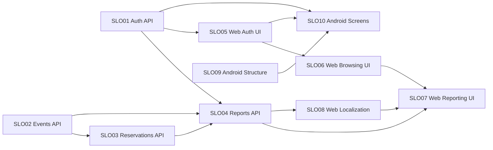

# D4: Impact Analysis

> **Status:** This document covers the Phase 2 Part 2 maintenance plan. Web work for CR-01 through CR-06 is completed and verified. Android work for CR-07 through CR-10 is also completed and verified. Active backend is Supabase Edge Functions.

## 1. Overview

Phase 2 Part 2 adds three new features to the Booth Organizer System:

1. **Administrative Reporting** — Booth Managers can filter events and download reservation/payment reports as CSV.
2. **UI Localization** — Static UI text can be switched between English and Thai.
3. **Native Android App** — A mobile app supports core user-facing functions.

The system has an active Supabase Edge Functions backend, a React web frontend, and an inherited FastAPI backend (reference only, non-blocking in CI).

## 2. Requirements Artifacts

| ID | Requirement | Change Request | Feature |
|---|---|---|---|
| R01 | Backend report endpoints with event filter | CR-01 | Reporting |
| R02 | Web report table and filter UI | CR-02 | Reporting |
| R03 | CSV export for report data | CR-03 | Reporting |
| R04 | Report empty/error states and tests | CR-04 | Reporting |
| R05 | EN/TH static UI text files | CR-05 | Localization |
| R06 | Language toggle; database content unchanged | CR-06 | Localization |
| R07 | Android project shell with navigation | CR-07 | Android |
| R08 | Android login with JWT and token storage | CR-08 | Android |
| R09 | Android event and booth browsing | CR-09 | Android |
| R10 | Android reservation, payment, reports, localization | CR-10 | Android |

## 3. Design Artifacts

| ID | Design Item | Description | Affected By |
|---|---|---|---|
| D01 | Edge Reports API Design | GET /reports/events, GET /reports/reservations-payments, GET /reports/reservations-payments.csv | R01, R03 |
| D02 | Web Reports Page Design | Event dropdown, data table, CSV download button, loading/empty/error states | R02, R04 |
| D03 | CSV Export Workflow Design | Backend streams CSV; frontend triggers download | R03 |
| D04 | Report State Design | Empty report, invalid event, error response shapes | R04 |
| D05 | i18n Translation Structure Design | EN/TH locale files, Translation keys, namespace conventions | R05 |
| D06 | Language Toggle Design | Toggle button placement, localStorage persistence, content rule | R06 |
| D07 | Android Project Design | Gradle structure, base activities, navigation graph, INTERNET permission | R07 |
| D08 | Android Auth Design | Login screen, SharedPreferences token storage, bearer client | R08 |
| D09 | Android Browsing Design | Event list, booth list, pull-to-refresh, loading states | R09 |
| D10 | Android Feature Design | Reservation screen, payment screen, report screen, EN/TH toggle | R10 |

## 4. Code Modules

| ID | Code Module | File(s) | Change Request |
|---|---|---|---|
| C01 | Edge report endpoints | `supabase/functions/api/index.ts` (report functions) | CR-01 |
| C02 | Web ReportsPage component | `implementations/frontend/src/pages/ReportsPage.js` | CR-02 |
| C03 | CSV export endpoint and button | `supabase/functions/api/index.ts` (CSV function), `ReportsPage.js` (button) | CR-03 |
| C04 | Report state handling | `ReportsPage.js` (empty/error states) | CR-04 |
| C05 | i18n locale files and config | `implementations/frontend/src/locales/en.json`, `th.json`, `i18n.js`, `LanguageToggle.js` | CR-05 |
| C06 | Language toggle and DB rule | `implementations/frontend/src/components/LanguageToggle.js` | CR-06 |
| C07 | Android project structure | `implementations/mobile/app/src/main/java/com/kkaovsp/boothorganizer/MainActivity.kt`, `AndroidManifest.xml`, Gradle files | CR-07 |
| C08 | Android auth flow | `ApiClient.kt`, `MainActivity.kt` (login screen, SharedPreferences token storage, bearer client) | CR-08 |
| C09 | Android event/booth screens | `MainActivity.kt` (event list, booth list, pull-to-refresh, loading states) | CR-09 |
| C10 | Android all remaining screens | `MainActivity.kt`, `ApiClient.kt` (reservation, payment, reports, EN/TH toggle, manager navigation) | CR-10 |

## 5. Test Modules

| ID | Test Module | Test Command / File | Change Request |
|---|---|---|---|
| T01 | Edge report helper tests | `npx deno test api/index_test.ts` (Deno helper coverage, 25 tests); deployed smoke tests cover actual report endpoints (`node scripts/smoke-test-edge-api.mjs`) | CR-01 |
| T02 | Web report UI tests | `npx react-scripts test ReportsPage.test.js` | CR-02 |
| T03 | CSV export smoke check | `node scripts/smoke-test-edge-api.mjs` (CSV endpoint) | CR-03 |
| T04 | Report empty/error state tests | `npx react-scripts test ReportsPage.test.js` (state tests) | CR-04 |
| T05 | Localization toggle tests | `npx react-scripts test LanguageToggle.test.js` | CR-05 |
| T06 | Database unchanged check | Manual inspection after language toggle | CR-06 |
| T07 | Android shell build | `./gradlew.bat --no-daemon assembleDebug`; APK built successfully | CR-07 |
| T08 | Android login test | Emulator `BoothOrganizer_API35` / `emulator-5554`; APK install via `adb install`; login screen renders, token stored, no `FATAL EXCEPTION` | CR-08 |
| T09 | Android browsing test | Runtime check: event list loads, booth list loads, pull-to-refresh works, loading states shown | CR-09 |
| T10 | Android feature test | Runtime check: reservation creation, payment flow, reports generation, EN/TH language toggle, manager navigation, no `FATAL EXCEPTION` | CR-10 |

## 6. Full Traceability Graph

```mermaid
graph TB
    subgraph Requirements
        R01["R01: Report API"]
        R02["R02: Web Report UI"]
        R03["R03: CSV Export"]
        R04["R04: Report States"]
        R05["R05: EN/TH Files"]
        R06["R06: Toggle + DB Rule"]
        R07["R07: Android Shell"]
        R08["R08: Android Login"]
        R09["R09: Android Browsing"]
        R10["R10: Android Features"]
    end

    subgraph Design
        D01["D01: Edge Reports API"]
        D02["D02: Web Reports Page"]
        D03["D03: CSV Export Flow"]
        D04["D04: Report State Design"]
        D05["D05: i18n Structure"]
        D06["D06: Toggle Design"]
        D07["D07: Android Project"]
        D08["D08: Android Auth"]
        D09["D09: Android Browsing"]
        D10["D10: Android Features"]
    end

    subgraph Code
        C01["C01: Edge Reports API"]
        C02["C02: ReportsPage.js"]
        C03["C03: CSV Export"]
        C04["C04: Report States"]
        C05["C05: i18n Files"]
        C06["C06: LanguageToggle"]
        C07["C07: Android Shell"]
        C08["C08: Android Auth"]
        C09["C09: Android Browsing"]
        C10["C10: Android Features"]
    end

    subgraph Test
        T01["T01: Edge Report Tests"]
        T02["T02: Web Report Tests"]
        T03["T03: CSV Smoke Test"]
        T04["T04: Report State Tests"]
        T05["T05: i18n Toggle Tests"]
        T06["T06: DB Unchanged Check"]
        T07["T07: Android Build"]
        T08["T08: Android Login Test"]
        T09["T09: Android Browse Test"]
        T10["T10: Android Feature Test"]
    end

    R01 -.-> D01
    R02 -.-> D02
    R03 -.-> D03
    R04 -.-> D04
    R05 -.-> D05
    R06 -.-> D06
    R07 -.-> D07
    R08 -.-> D08
    R09 -.-> D09
    R10 -.-> D10

    D01 -.-> C01
    D02 -.-> C02
    D03 -.-> C03
    D04 -.-> C04
    D05 -.-> C05
    D06 -.-> C06
    D07 -.-> C07
    D08 -.-> C08
    D09 -.-> C09
    D10 -.-> C10

    C01 -.-> T01
    C02 -.-> T02
    C03 -.-> T03
    C04 -.-> T04
    C05 -.-> T05
    C06 -.-> T06
    C07 -.-> T07
    C08 -.-> T08
    C09 -.-> T09
    C10 -.-> T10

style R01 fill:#bbf3b3
    style R02 fill:#bbf3b3
    style R03 fill:#bbf3b3
    style R04 fill:#bbf3b3
    style R05 fill:#bbf3b3
    style R06 fill:#bbf3b3
    style R07 fill:#bbf3b3
    style R08 fill:#bbf3b3
    style R09 fill:#bbf3b3
    style R10 fill:#bbf3b3
    style D07 fill:#bbf3b3
    style D08 fill:#bbf3b3
    style D09 fill:#bbf3b3
    style D10 fill:#bbf3b3
    style C07 fill:#bbf3b3
    style C08 fill:#bbf3b3
    style C09 fill:#bbf3b3
    style C10 fill:#bbf3b3
    style T07 fill:#bbf3b3
    style T08 fill:#bbf3b3
    style T09 fill:#bbf3b3
    style T10 fill:#bbf3b3
```

**Legend:** All items are completed (green). CR-01 to CR-06 are web features; CR-07 to CR-10 are Android features.

## 7. Affected-Part Traceability (Maintenance Scope)

```mermaid
---
id: bf3f6cbf-a697-4c47-9dcb-31869c389c17
---
graph TB
    subgraph Requirements
        R01["R01: Report API"]
        R02["R02: Web Report UI"]
        R03["R03: CSV Export"]
        R04["R04: Report States"]
        R05["R05: EN/TH Files"]
        R06["R06: Toggle + DB Rule"]
        R07["R07: Android Shell"]
        R08["R08: Android Login"]
        R09["R09: Android Browsing"]
        R10["R10: Android Features"]
    end

    subgraph Design
        D01["D01: Edge Reports API"]
        D02["D02: Web Reports Page"]
        D03["D03: CSV Export Flow"]
        D04["D04: Report State Design"]
        D05["D05: i18n Structure"]
        D06["D06: Toggle Design"]
        D07["D07: Android Project"]
        D08["D08: Android Auth"]
        D09["D09: Android Browsing"]
        D10["D10: Android Features"]
    end

    subgraph Code
        C01["C01: Edge Reports API"]
        C02["C02: ReportsPage.js"]
        C03["C03: CSV Export"]
        C04["C04: Report States"]
        C05["C05: i18n Files"]
        C06["C06: LanguageToggle"]
        C07["C07: Android Shell"]
        C08["C08: Android Auth"]
        C09["C09: Android Browsing"]
        C10["C10: Android Features"]
    end

    subgraph Test
        T01["T01: Edge Helper Tests"]
        T02["T02: Web Report Tests"]
        T03["T03: CSV Smoke Test"]
        T04["T04: Report State Tests"]
        T05["T05: i18n Toggle Tests"]
        T06["T06: DB Unchanged Check"]
        T07["T07: Android Build"]
        T08["T08: Android Login Test"]
        T09["T09: Android Browse Test"]
        T10["T10: Android Feature Test"]
    end

    R01 -.-> D01
    R02 -.-> D02
    R03 -.-> D03
    R04 -.-> D04
    R05 -.-> D05
    R06 -.-> D06
    R07 -.-> D07
    R08 -.-> D08
    R09 -.-> D09
    R10 -.-> D10

    D01 -.-> C01
    D02 -.-> C02
    D03 -.-> C03
    D04 -.-> C04
    D05 -.-> C05
    D06 -.-> C06
    D07 -.-> C07
    D08 -.-> C08
    D09 -.-> C09
    D10 -.-> C10

    C01 -.-> T01
    C02 -.-> T02
    C03 -.-> T03
    C04 -.-> T04
    C05 -.-> T05
    C06 -.-> T06
    C07 -.-> T07
    C08 -.-> T08
    C09 -.-> T09
    C10 -.-> T10

    style R01 fill:#bbf3b3
    style R02 fill:#bbf3b3
    style R03 fill:#bbf3b3
    style R04 fill:#bbf3b3
    style R05 fill:#bbf3b3
    style R06 fill:#bbf3b3
    style R07 fill:#bbf3b3
    style R08 fill:#bbf3b3
    style R09 fill:#bbf3b3
    style R10 fill:#bbf3b3
    style D07 fill:#bbf3b3
    style D08 fill:#bbf3b3
    style D09 fill:#bbf3b3
    style D10 fill:#bbf3b3
    style C07 fill:#bbf3b3
    style C08 fill:#bbf3b3
    style C09 fill:#bbf3b3
    style C10 fill:#bbf3b3
    style T07 fill:#bbf3b3
    style T08 fill:#bbf3b3
    style T09 fill:#bbf3b3
    style T10 fill:#bbf3b3
```

**Legend:** All items are completed (green). CR-01 to CR-06 are web features; CR-07 to CR-10 are Android features.

## 8. Software Lifecycle Object (SLO) Graph

> If the diagram below appears as raw code, open this file in GitHub or a Markdown viewer with Mermaid support.

**Dependency summary:** Auth API (SLO01) connects to all authenticated services. Events API (SLO02) and Reservations API (SLO03) both feed Reports API (SLO04). Reports API connects to both Web Reporting UI (SLO07) and Web Localization (SLO08). Web Auth UI (SLO05) links Browsing UI (SLO06) and Android Screens (SLO10). Android Structure (SLO09) is the base for Android Screens (SLO10).

## 9. SLO Connectivity Matrix

The table below shows undirected shortest-path distances. The SLO graph in Section 8 uses directed arrows, but for measuring impact distance we ignore arrow direction and treat all 13 edges as bidirectional. The matrix is therefore symmetric: distance(A, B) equals distance(B, A).

| From / To | SLO01 | SLO02 | SLO03 | SLO04 | SLO05 | SLO06 | SLO07 | SLO08 | SLO09 | SLO10 |
|---|:---:|:---:|:---:|:---:|:---:|:---:|:---:|:---:|:---:|:---:|
| **SLO01** | 0 | 2 | 2 | 1 | 1 | 2 | 2 | 2 | 2 | 1 |
| **SLO02** | 2 | 0 | 1 | 1 | 2 | 3 | 2 | 2 | 3 | 2 |
| **SLO03** | 2 | 1 | 0 | 1 | 2 | 2 | 2 | 2 | 3 | 2 |
| **SLO04** | 1 | 1 | 1 | 0 | 2 | 2 | 1 | 1 | 3 | 2 |
| **SLO05** | 1 | 2 | 3 | 2 | 0 | 1 | 2 | 3 | 2 | 1 |
| **SLO06** | 2 | 3 | 3 | 2 | 1 | 0 | 1 | 2 | 3 | 2 |
| **SLO07** | 2 | 2 | 2 | 1 | 2 | 1 | 0 | 1 | 3 | 2 |
| **SLO08** | 2 | 2 | 2 | 1 | 3 | 2 | 1 | 0 | 3 | 2 |
| **SLO09** | 2 | 3 | 4 | 3 | 2 | 3 | 3 | 3 | 0 | 1 |
| **SLO10** | 1 | 2 | 3 | 2 | 1 | 2 | 2 | 2 | 1 | 0 |

**Interpretation:** The matrix is symmetric. SLO01 (Auth API) and SLO10 (Android Screens) each have the most direct connections (distance 1 to four other SLOs). SLO04 (Reports API) and SLO07 (Web Reporting UI) are tightly coupled — distance 1 to each other and to SLO08 (Localization). SLO09 (Android Structure) is the most isolated: distance 1 only to SLO10, and distance 3–4 from all web and backend SLOs.

## 10. Change Request Difficulty

### Easier to Apply

| CR | Why it is easier |
|---|---|
| CR-03 (CSV Export) | The reporting API already returns structured data. Adding CSV formatting and a download endpoint is a thin layer on existing code. The frontend button triggers an existing endpoint. |
| CR-04 (Report States) | Adding empty-state and error-state handling to an existing React component is straightforward. The component already has a loading state; adding error boundaries and empty messages requires only a few conditional renders and a test. |
| CR-06 (Database Unchanged Rule) | This is a design rule, not a code change. The language toggle only touches static UI text in translation files. No backend or data-layer code is affected. |

### More Difficult to Apply

| CR | Why it is harder |
|---|---|
| CR-02 (Web Report UI) | Requires coordinating a backend API response shape, a frontend data table with sorting and pagination, and a CSV download button. Multiple files and languages (TypeScript/React/HTML) must stay consistent. |
| CR-05 (EN/TH Localization) | Requires creating a translation architecture (i18n config, locale files, namespace conventions) that all future developers must follow. Mistakes affect every page, not just one component. |
| CR-07 to CR-10 (Android App) | Required setting up a full Android project from scratch: Gradle configuration, Android manifest, activities, navigation, API client, and authentication flow. No existing Android baseline existed to extend. Platform differences (Android hardware buttons, intent handling, different HTTP client, SDK and emulator setup) added complexity not present in the web frontend. |

## 11. Recommendations for Previous Developers

To make future maintenance easier, the following practices would help:

1. **Document all API response shapes with examples.** The reporting endpoints were easier to implement because the existing API patterns were predictable. If previous developers had published example JSON responses for each endpoint, new features would be faster to add.

2. **Keep a shared translation key convention.** Adding EN/TH support required reviewing every React component to find hardcoded text. A convention for translation key naming (e.g., `page_section_element`) would let a linter find missing keys automatically.

3. **Separate integration-tested code from unit-tested code.** The Edge Function handler (~1,000 lines) cannot be unit tested without a mock Supabase client. If the router and business logic had been separated into smaller functions with dependency injection, unit test coverage would be higher without requiring live cloud credentials.

4. **Provide an API contract or Postman collection.** New developers integrating the Android app will need to know the exact request shapes, authentication headers, and response formats for all endpoints. A shared API contract reduces back-and-forth.

5. **Add inline comments for non-obvious business rules.** The database-content-unchanged rule for localization was not written in any code comment. A developer who did not attend the requirements meeting would not know why the toggle does not translate event names.

## 12. Current Status Summary

| Feature | CRs | Status |
|---|---|---|
| Administrative Reporting | CR-01 to CR-04 | Completed and verified: Edge API deployed, web ReportsPage implemented, smoke tests 19/19, Deno unit tests 25/25 at 90.2% coverage on 184 lines |
| UI Localization | CR-05 to CR-06 | Completed and verified: i18n structure with EN/TH files, LanguageToggle component, frontend tests pass, database content unchanged by design |
| Native Android App | CR-07 to CR-10 | Completed and verified: native Android project built with `./gradlew.bat --no-daemon assembleDebug`, APK installed and launched on emulator `BoothOrganizer_API35` / `emulator-5554`, runtime verified for login, events, booths, reservations, profile, reports, language toggle, and manager navigation; no `FATAL EXCEPTION` |

The active backend for web features is Supabase Edge Functions at `https://uaoufhdysqcivheauwyf.supabase.co/functions/v1/api`. Legacy FastAPI backend (`implementations/backend/`) is retained as a non-blocking reference job in CI and is excluded from the active SonarCloud scan scope.