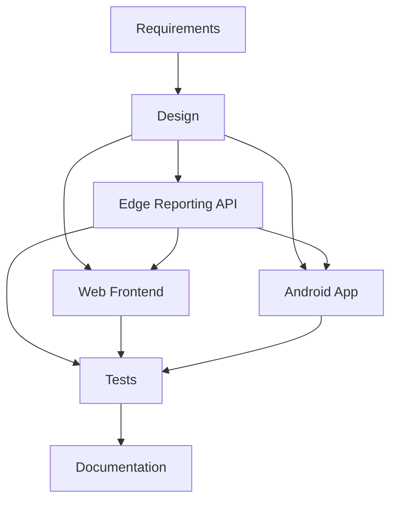

# D4: Impact Analysis

> **Note:** This document is being updated for the current 10-CR plan. Before final submission, the full traceability graph, affected-only graph, SLO graph, and connectivity matrix must all use the same 10 CRs.

## 1. Overview

This document analyzes the expected impact of the Phase 2 Part 2 maintenance work on the inherited Booth Organizer System.

The maintenance work focuses on:

1. UI Localization with English/Thai language toggle
2. Administrative Reporting System
3. Native Android mobile application support

## 2. Affected Requirements

| Requirement ID | Requirement | Affected Area |
|---|---|---|
| R-LOC-01 | Users can switch static UI text between English and Thai | Web Frontend, Android App |
| R-LOC-02 | User-generated content is not translated | Web Frontend, Android App |
| R-REP-01 | Booth Managers can generate event-based reports | Backend, Web Frontend, Android App |
| R-REP-02 | Booth Managers can export report data as CSV | Backend, Web Frontend, Android App |
| R-MOB-01 | A native Android app supports user-facing functions | Android App, Backend API |

## 3. Affected Modules

| Module | Reason for Impact |
|---|---|
| Backend report routes | New reporting endpoints are required |
| Backend report schemas | Report request and response formats are required |
| Backend report service | Reservation and payment data must be collected for reports |
| Web localization files | Static UI text must support English and Thai |
| Web language toggle component | Users need a visible language switch |
| Web reports page | Booth Managers need a report UI |
| Android app | Mobile version must support main user flows and new features |
| Tests | New behavior must be verified and covered |

## 4. Requirements to Code Traceability

| Requirement | Design or Module | Code Area | Verification |
|---|---|---|---|
| R-LOC-01 | Localization dictionary and language state | Web i18n files, LanguageToggle, Android localization resources | Language toggle tests and UI inspection |
| R-LOC-02 | Data display rule | Event/report display components | Test that API data stays unchanged |
| R-REP-01 | Reporting API and report UI | Backend report routes/service, Web Reports page, Android Reports screen | API tests and UI tests |
| R-REP-02 | CSV export workflow | Backend CSV endpoint, Web/Mobile export action | CSV output test and inspection |
| R-MOB-01 | Mobile app screens | Android app source files | Android build, tests, and emulator inspection |

## 5. Affected-Part Traceability

| Change Request | Affected Modules | Test or Evidence |
|---|---|---|
| CR-01 | Backend report routes, report schemas, report service | Backend API tests and response inspection |
| CR-02 | Web reports page, event dropdown, report table | Web UI screenshot and browser inspection |
| CR-03 | Backend CSV endpoint, web CSV download button | CSV output evidence |
| CR-04 | Backend validation, web empty/error states, tests | Empty/error case tests |
| CR-05 | Web localization files and static UI text | EN/TH UI screenshots |
| CR-06 | Language toggle component and data display components | Toggle test and unchanged data inspection |
| CR-07 | Android project/repository structure | Android build evidence |
| CR-08 | Android login screen, token storage, API client | Login test/emulator screenshot |
| CR-09 | Android event and booth browsing screens | Event/booth browsing screenshots |
| CR-10 | Android reservation, payment, reporting, localization screens | Android user-flow screenshots and build result |

## 6. Software Lifecycle Object Graph

## 7. Connectivity Matrix

| From / To | Requirements | Design | Backend | Web | Mobile | Tests | Docs |
|---|---:|---:|---:|---:|---:|---:|---:|
| Requirements | 0 | 1 | 2 | 2 | 2 | 3 | 4 |
| Design | 1 | 0 | 1 | 1 | 1 | 2 | 3 |
| Backend | 2 | 1 | 0 | 1 | 1 | 1 | 2 |
| Web | 2 | 1 | 1 | 0 | 2 | 1 | 2 |
| Mobile | 2 | 1 | 1 | 2 | 0 | 1 | 2 |
| Tests | 3 | 2 | 1 | 1 | 1 | 0 | 1 |
| Docs | 4 | 3 | 2 | 2 | 2 | 1 | 0 |

## 8. Impact Summary

The highest impact areas are the reporting API and the user interfaces for web and mobile. The localization feature mostly affects static UI text and should not affect database content. The reporting feature has a stronger backend impact because it requires event filtering, reservation/payment data retrieval, and CSV export.

The main risk is inconsistent behavior between web and Android. This risk is reduced by using the same backend reporting endpoints for both platforms and by keeping the localization behavior simple.
