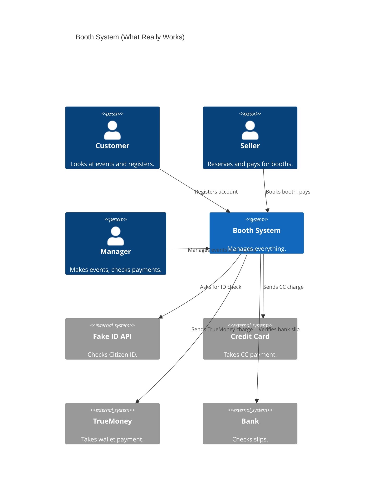

# D1: System Run and Handoff Report

## 1. Did the System Run?
Yes, the Booth Organizer System worked on my Mac computer.

- **Backend (FastAPI)**: Started and running at `http://127.0.0.1:8000`.
- **Frontend (React)**: Started and running at `http://localhost:3000`.
- **Database**: Worked fine. The first user (Booth Manager) was created successfully.

## 2. Another Way to Run the Program
Instead of just running commands one by one, you can run the program easily and safely using a virtual environment:

**Run the Backend on Mac/Linux:**
```bash
cd implementations/backend
python3 -m venv venv
source venv/bin/activate
pip install -r requirements.txt
uvicorn app.main:app --reload --env-file .env
```

**Run the Frontend:**
```bash
cd implementations/frontend
npm install
npm start
```

## 3. Problems in README.md and How to Fix Them

When I tried to use the `README.md`, I found some errors:

### Error 1: Linux Commands on Mac/Windows

**Problem:** The README says to use `sudo apt update`. This only works on Linux or Codespaces. It gives an error on Mac or Windows.
**Fix:** Tell Mac users to install Python using Homebrew, and Windows users to use the official Python installer instead.

### Error 2: Installing Python Packages Everywhere
**Problem:** The README says `pip install -r requirements.txt`. This puts files all over your computer. It can break other Python apps.
**Fix:** Always use a "virtual environment" (like `python3 -m venv venv`) before using `pip install`.

### Error 3: Python Command Names
**Problem:** The README uses `python3` for Codespaces and `python` for Windows. It doesn't mention Mac.
**Fix:** Tell Mac users they must use `python3`.

## Conclusion
The application code works well. Once I used the correct commands for my Mac, the program ran without any bugs.

---

# D2: Project Review

## 1. You must explain the features of the project that you received.

### 1. User Management & Authentication

- ✅ **Done:** Registration: General users must be able to register for an account. The registration form is simple and functional.
- ⚠️ **Partial:** Mandatory Field: The system must collect the user's "Citizen ID" during registration. The schema supports `citizen_id` and there is some mock validation, but it is not strictly enforced as a mandatory field for all user registrations at the base schema level.
- ⚠️ **Partial:** Identity Verification: The system must integrate (or be designed to integrate) with the Ministry of Interior's database to verify the authenticity of the Citizen ID. A mock API (`/api/mock/moi/verify`) was implemented for testing, but not a real integration.
- ✅ **Done:** Login/Logout: Support authentication for both General Users and Booth Managers. Standard JWT-based login/logout works easily.

### 2. General User / Member Features (Front-end)

- ❌ **Not Done:** Search: Users can search for events by "Event Name" or flea markets by "Location". There is no search bar or functionality implemented on the frontend.
- ⚠️ **Partial:** Browse: Users can view event details, booth information, and promotions. Users can view event and booth details, but promotions are not supported yet.
- ❌ **Not Done:** Floor Plan UI: The system must display a visual floor plan showing the overall layout and booth positions. No floor plan picture or interactive map is available.
- ❌ **Not Done:** Direct Reservation: Users can click and reserve a booth directly from the floor plan interface. Without a floor map, this is omitted.
- ✅ **Done:** Reservation Types: Must support both short-term bookings (e.g., 1-3 day events) and long-term bookings (e.g., monthly/yearly flea market rentals). Short and long booth reservations are fully supported.

### 3. Booth Manager / Back-office Features

- ✅ **Done:** Event Management: Ability to create and configure event details (date, time, location). Making new events is functional and easy to use.
- ❌ **Not Done:** Floor Plan Management: Ability to create and modify the event's floor plan. Not implemented.
- ✅ **Done:** Booth Configuration: Ability to specify booth details including size, price, and specific facilities (e.g., electrical outlets, water pipes). Booth managers can specify sizing, price, and electricity when creating booths.
- ✅ **Done:** Reservation Approval: Ability to review uploaded bank transfer slips and manually approve/confirm reservations. Checking payment slips works properly in the manager dashboard.
- ❌ **Not Done:** Reporting: Ability to generate summary reports covering booking data, payment/revenue, and overall event statistics. No reporting or revenue metrics are present.

### 4. Payment Integration

- ✅ **Done:** Payment Terms: Must enforce one-time/full-price payments only (no installment plans supported). Only full-price payment logic is allowed.
- ✅ **Done:** Payment Method 1: Support for Credit Card payments. The UI allows selecting credit card.
- ✅ **Done:** Payment Method 2: Support for TrueMoney Wallet. The UI allows selecting TrueMoney.
- ✅ **Done:** Payment Method 3: Support for Bank Transfer, which strictly requires a feature for users to upload their payment slip. Both the upload and the verification by the manager are implemented.

### 5. Non-Functional Requirements

- ❌ **Not Done:** Localization: The User Interface must support two languages: Thai and English. Only English is handled currently.
- ✅ **Done:** Usability: The system must be designed with a user-friendly interface. The application's design is clean, straightforward, and easy to use.

---

## 2. Verification results of the design (C4 and others) compared to the actual implementation. You must report consistencies and update the C4 diagram.
The code does not perfectly match the original D1 design diagrams:

1. **No Reports:** The design showed a reporting feature, but the code has none.
2. **No Search:** The design said users could search booths, but there is no search function.
3. **No Floor Map:** The design expected a floor plan picture, but it's not made.

### Real Use Case Diagram (What is actually working)



---

## 3. Report the reflections on receiving the handover project.

### a. What technologies are used?
- **Backend:** Python, FastAPI, and SQLite Database.
- **Frontend:** React and simple CSS.

### b. What is the required information to successfully hand over the project?
To pass this project to the next team, they must know:
1. **Missing Features:** Tell them exactly what is missing (like Reports and Search).
2. **Setup Steps:** Give them simple steps to run the code on Mac, Linux, and Windows.
3. **Fake Payments:** Explain how the fake payment API works so they don't break it.

### c. What is the code quality of the handover project (by running SonarQube)?
#### 1. SonarQube Dashboard Overview


#### 2. Maintainability Issues

