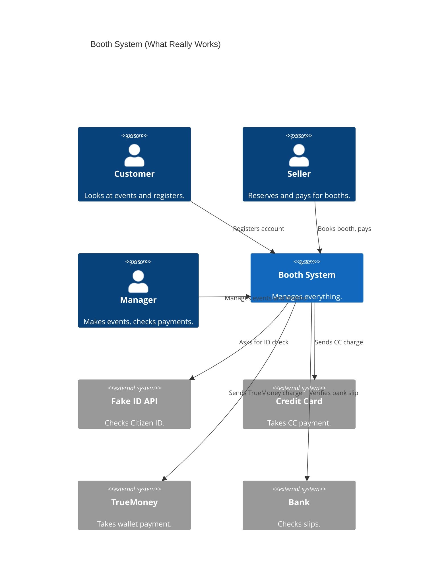

# D1: System Run and Handoff Report

## 1. Did the System Run?
Yes, the Booth Organizer System worked on my Mac computer.

- **Backend (FastAPI)**: Started and running at `http://127.0.0.1:8000`.
- **Frontend (React)**: Started and running at `http://localhost:3000`.
- **Database**: Worked fine. The first user (Booth Manager) was created successfully.

## 2. Another Way to Run the Program
Instead of just running commands one by one, you can run the program easily and safely using a virtual environment:

**Run the Backend on Mac/Linux:**
```bash
cd implementations/backend
python3 -m venv venv
source venv/bin/activate
pip install -r requirements.txt
uvicorn app.main:app --reload --env-file .env
```

**Run the Frontend:**
```bash
cd implementations/frontend
npm install
npm start
```

## 3. Problems in README.md and How to Fix Them

When I tried to use the `README.md`, I found some errors:

### Error 1: Linux Commands on Mac/Windows

**Problem:** The README says to use `sudo apt update`. This only works on Linux or Codespaces. It gives an error on Mac or Windows.
**Fix:** Tell Mac users to install Python using Homebrew, and Windows users to use the official Python installer instead.

### Error 2: Installing Python Packages Everywhere
**Problem:** The README says `pip install -r requirements.txt`. This puts files all over your computer. It can break other Python apps.
**Fix:** Always use a "virtual environment" (like `python3 -m venv venv`) before using `pip install`.

### Error 3: Python Command Names
**Problem:** The README uses `python3` for Codespaces and `python` for Windows. It doesn't mention Mac.
**Fix:** Tell Mac users they must use `python3`.

## Conclusion
The application code works well. Once I used the correct commands for my Mac, the program ran without any bugs.

---

# D2: Project Review

## 1. You must explain the features of the project that you received.

### User Accounts
- ✅ **Done:** User Registration.
- ⚠️ **Half Done:** Citizen ID check.
- ✅ **Done:** Fake API for ID check.
- ✅ **Done:** Login and Logout.

### General Customer (Frontend)
- ❌ **Not Done:** Searching for events or booths (no search bar).
- ⚠️ **Half Done:** Viewing events (cannot see promotions).
- ❌ **Not Done:** Floor Map picture.
- ❌ **Not Done:** Reserving from the Floor Map.
- ✅ **Done:** Short and long booth reservations.

### Booth Manager Features
- ✅ **Done:** Making new events.
- ❌ **Not Done:** Drawing Floor Maps.
- ✅ **Done:** Changing booth size, price, and electricity.
- ✅ **Done:** Checking payment slips.
- ❌ **Not Done:** Revenue or Booking reports.

### Payments
- ✅ **Done:** Paying full price at once.
- ✅ **Done:** Credit Card, TrueMoney Wallet, and Bank Transfer with slip.

### Other Rules
- ❌ **Not Done:** Thai Language (only English).
- ✅ **Done:** Easy to use design.

---

## 2. Verification results of the design (C4 and others) compared to the actual implementation. You must report consistencies and update the C4 diagram.
The code does not perfectly match the original D1 design diagrams:

1. **No Reports:** The design showed a reporting feature, but the code has none.
2. **No Search:** The design said users could search booths, but there is no search function.
3. **No Floor Map:** The design expected a floor plan picture, but it's not made.

### Real Use Case Diagram (What is actually working)



---

## 3. Report the reflections on receiving the handover project.

### a. What technologies are used?
- **Backend:** Python, FastAPI, and SQLite Database.
- **Frontend:** React and simple CSS.

### b. What is the required information to successfully hand over the project?
To pass this project to the next team, they must know:
1. **Missing Features:** Tell them exactly what is missing (like Reports and Search).
2. **Setup Steps:** Give them simple steps to run the code on Mac, Linux, and Windows.
3. **Fake Payments:** Explain how the fake payment API works so they don't break it.

### c. What is the code quality of the handover project (by running SonarQube)?
#### 1. SonarQube Dashboard Overview


#### 2. Maintainability Issues

