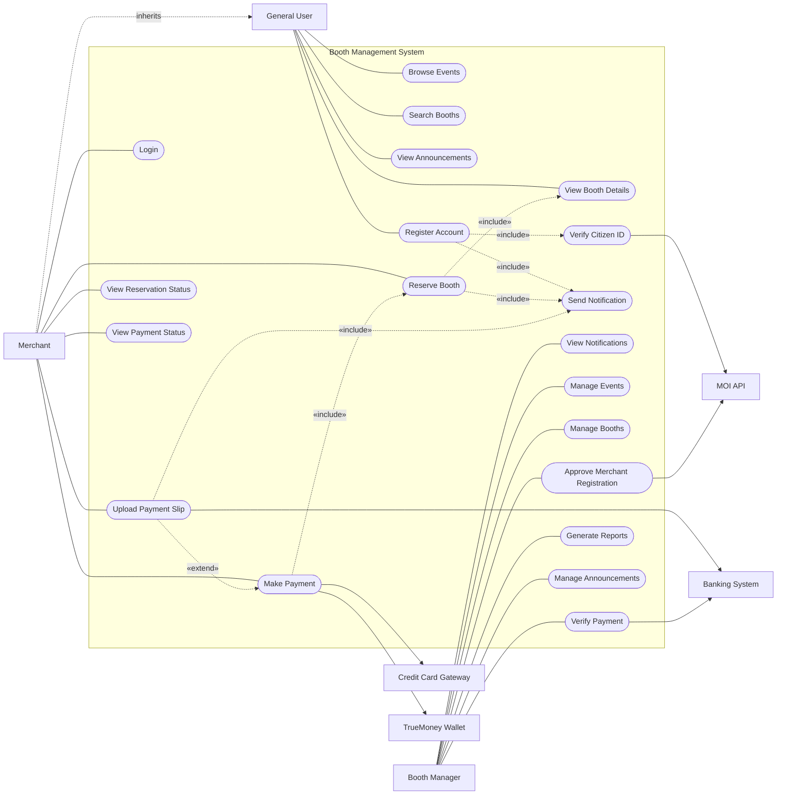
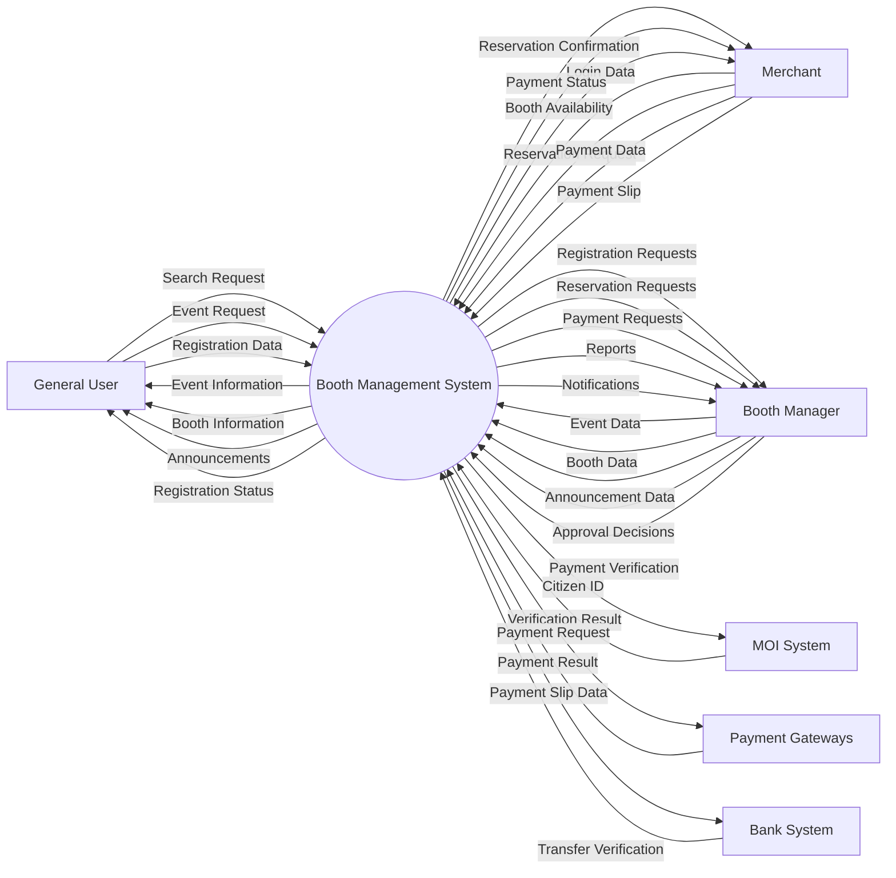
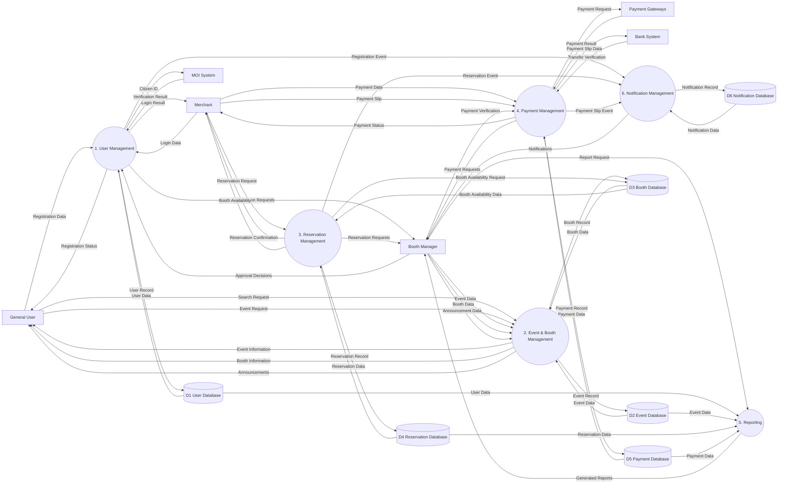
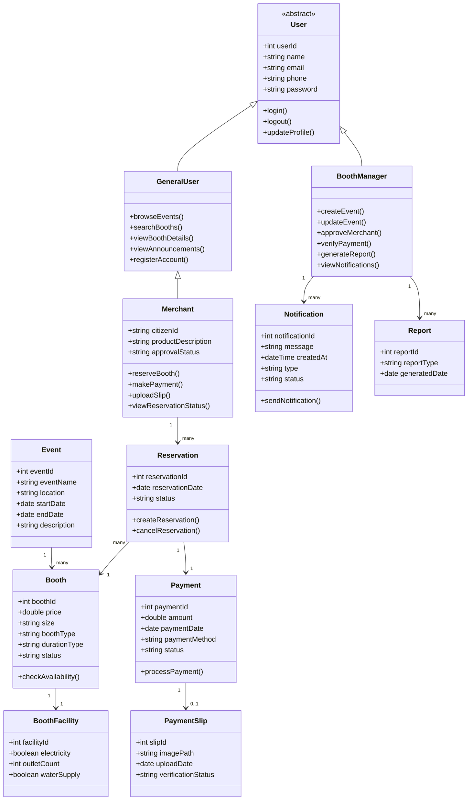

# D1 Design Models and Design Rationale
---

# C4 Context Diagram

---

# C4 Container Diagram

---

# C4 Component Diagram

---

# Use Case Diagram

## Diagram by Mermaid

---

# Data Flow Diagram (DFD)

## DFD Level 0

## DFD Level 1

---

# Class Diagram

---

# System Architecture and Design Rationale

The system models were developed based on the requirements of the Booth Organizer System to clearly show how the system works, how it is built, and how data moves through it. Each model gives a different view of the project and helps explain our key design choices, such as deciding what is built inside the system versus what uses external services.

The **Use Case Diagram** shows the system from the user’s point of view. It highlights how the active users, such as General Users, Merchants, and Booth Managers, interact with the system to perform tasks including registering, booking booths, paying, and managing events. This diagram helps clearly draw the line between our system's internal features (such as generating in-app notifications) and the external APIs we connect to.

The **Context Diagram** shows the big picture of the Booth Organizer System. It maps out all the human actorsincluding Executives, who act as stakeholders receiving reports from the Booth Manager outside the main software and the external systems we rely on. A major design decision shown here is keeping the MOI API, Credit Card Gateway, TrueMoney Wallet, and the Bank System as external services, while choosing to handle notifications internally rather than relying on a third-party messaging app.

The **Container Diagram** breaks down the high-level technical setup into three main parts: the Web Application (Frontend), Backend API Server, and Database. The frontend gives users their interface, while the backend API handles the core logic, including login security, booking workflows, payment processing, and creating in-app alerts. The database stores all persistent information, such as user accounts, events, and payment records. This standard three-tier setup makes the system secure, easy to maintain, and ready to grow.

The **Component Diagram** zooms in on the backend API and breaks it down into smaller, focused modules: Authentication, User, Event, Booth, Reservation, Payment, Reporting, and Notification components. Each part has a specific job. For example, the Reservation Component makes sure a booth cannot be double-booked, the Payment Component talks to the external gateways, and the Notification Component handles alerts for the Booth Manager. Breaking the code down this way keeps the system organized and easier for developers to update.

The **Data Flow Diagram (DFD)** shows exactly how information travels. It maps out how a General User submits registration data to become a Merchant, and how booking details and payment data flow between users, the database, and external services. The DFD makes sure our core workflows, particularly separating automated gateway payments from manual bank transfer verifications, follow a logical, step-by-step path.

Finally, the **Class Diagram** maps out the database structure by defining the main entities (including User, Merchant, BoothManager, Event, Booth, Reservation, and Payment) and how they connect. It uses inheritance to show that Merchants and Booth Managers are specialized types of Users. The links between Reservations, Booths, and Payments directly match our business rules, making sure every booking is properly tied to a financial transaction.

Together, these models give a complete, multi-layered view of the Booth Organizer System. From defining the user goals in the Use Case Diagram to mapping the code structure in the Component Diagram, this approach proves our system is well-organized, scalable, and has clearly separated responsibilities.
