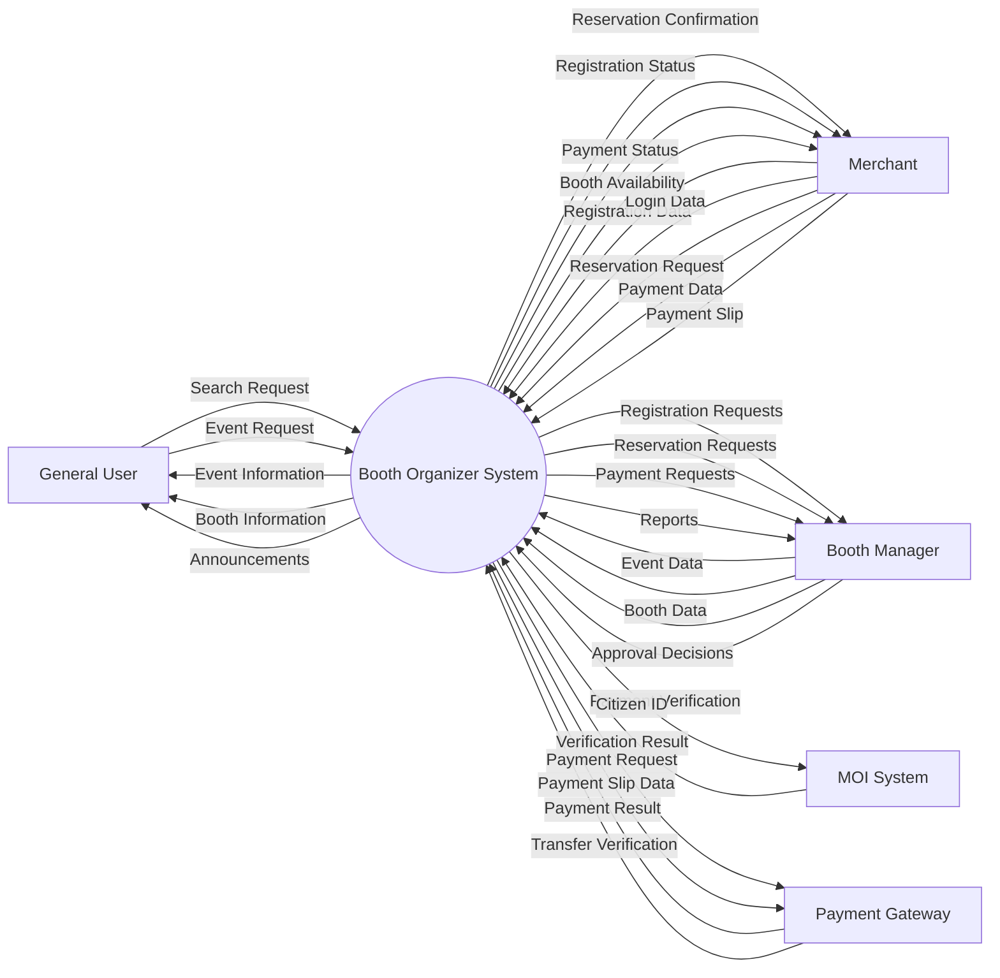
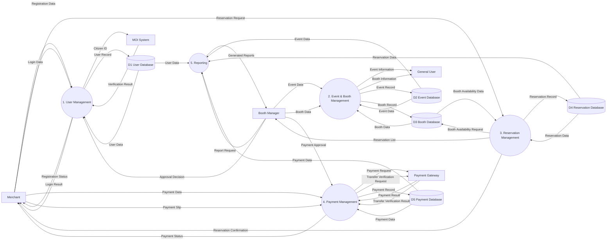

# D1 Design Models and Design Rationale
---

# C4 Context Diagram

(To be added)

---

# C4 Container Diagram

(To be added)

---

# C4 Component Diagram

(To be added)

---

# Use Case Diagram

(To be added)

---

# Data Flow Diagram (DFD)

## DFD Level 0


##DFD Level 1


---

# Class Diagram

```mermaid
classDiagram

%% Base User, Inheritance

class User {
  <<abstract>>
  +int userId
  +string name
  +string email
  +string phone
  +string password
  +login()
  +logout()
  +updateProfile()
}

%% Merchant (Verified User)

class Merchant {
  +string citizenId
  +string productDescription
  +string approvalStatus
  +register()
  +reserveBooth()
  +makePayment()
  +uploadSlip()
  +viewReservationStatus()
}

%% Booth Manager (Staff)

class BoothManager {
  +createEvent()
  +updateEvent()
  +approveMerchant()
  +verifyPayment()
  +generateReport()
}

User <|-- Merchant
User <|-- BoothManager

%% Event & Booth

class Event {
  +int eventId
  +string eventName
  +string location
  +date startDate
  +date endDate
  +string description
}

class Booth {
  +int boothId
  +double price
  +string size
  +string boothType
  +string durationType
  +string status
  +checkAvailability()
}

class BoothFacility {
  +int facilityId
  +boolean electricity
  +int outletCount
  +boolean waterSupply
}

Event "1" --> "many" Booth
Booth "1" --> "1" BoothFacility

%% Reservation & Payment

class Reservation {
  +int reservationId
  +date reservationDate
  +string status
  +createReservation()
  +cancelReservation()
}

class Payment {
  +int paymentId
  +double amount
  +date paymentDate
  +string paymentMethod
  +string status
  +processPayment()
}

class PaymentSlip {
  +int slipId
  +string imagePath
  +date uploadDate
  +string verificationStatus
}

Merchant "1" --> "many" Reservation
Reservation "many" --> "1" Booth
Reservation "1" --> "1" Payment
Payment "1" --> "0..1" PaymentSlip

%% Reporting

class Report {
  +int reportId
  +string reportType
  +date generatedDate
}

BoothManager "1" --> "many" Report
