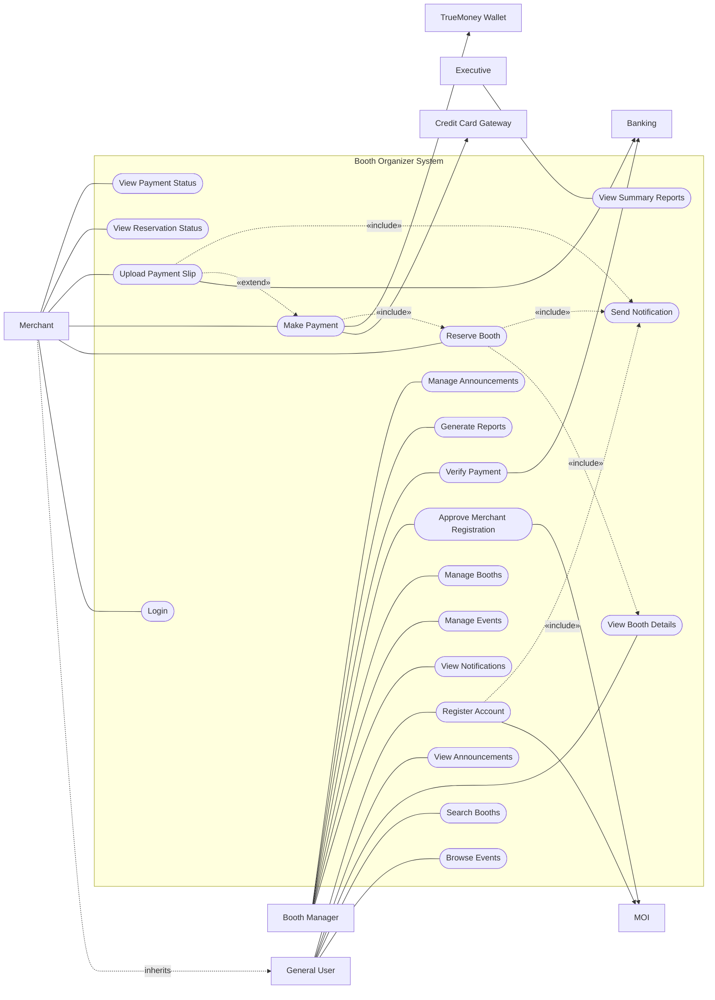
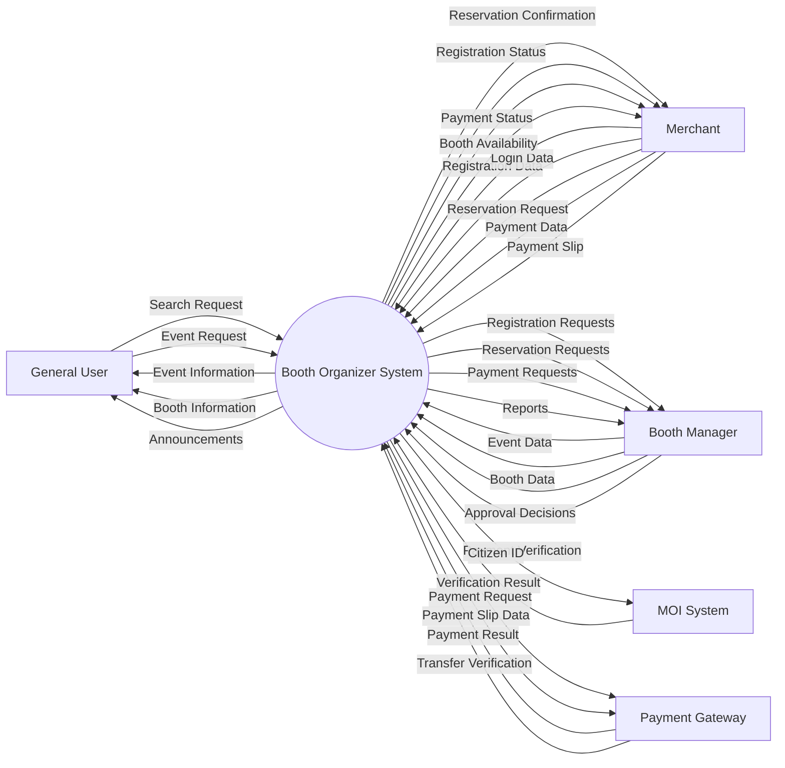
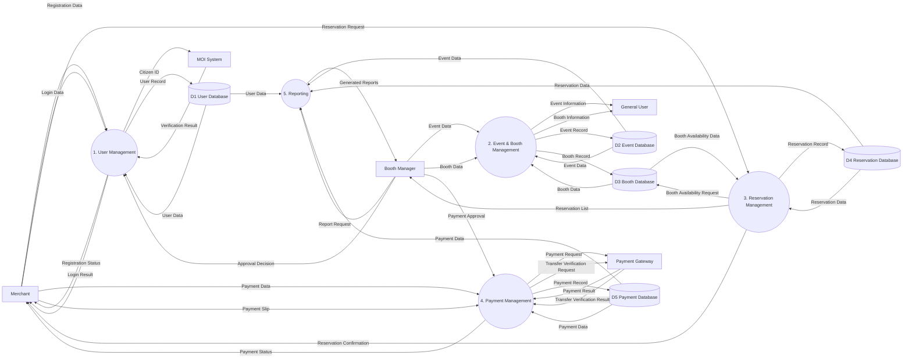
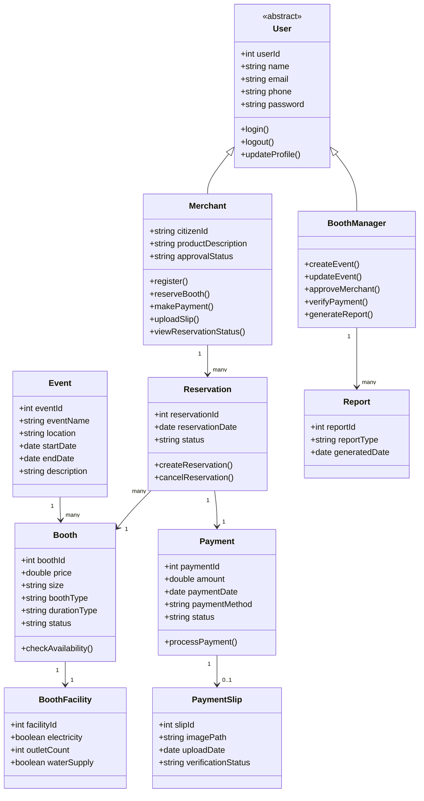

# D1 Design Models and Design Rationale
---

# C4 Context Diagram

---

# C4 Container Diagram

---

# C4 Component Diagram

---

# Use Case Diagram

(JPEG To be added)
## Diagram by Mermaid

---

# Data Flow Diagram (DFD)

## DFD Level 0

## DFD Level 1

---

# Class Diagram

# Design Rationale
The system models were developed based on the functional and non-functional requirements of the Booth Organizer System in order to clearly represent the system functionality, architecture, data interactions, and structural design. Each model provides a different perspective of the system and collectively supports key design decisions such as defining system boundaries, assigning responsibilities to system components, and clarifying how different parts of the system interact.

The **Use Case Diagram** represents the system from the user’s perspective and directly reflects the functional requirements identified during requirements analysis. It illustrates how the primary actors, such as General User, Merchant, and Booth Manager, interact with the system to perform tasks such as account registration, booth reservation, payment processing, and event management. By modeling these interactions, the Use Case Diagram helps identify the core system features and clarifies the system boundary by distinguishing between internal system functionality and external services such as the MOI identity verification API and payment gateways.

The **Context Diagram** presents the Booth Organizer System at the highest level and defines the overall system boundary. It shows how external actors, including General Users, Merchants, Booth Managers, and Executives, interact with the system, as well as how the system communicates with external services such as the MOI API, Credit Card Gateway, TrueMoney Wallet API, and the Banking System. This model supports an important design decision by clearly separating internal system responsibilities from external services, ensuring that identity verification and payment processing are handled by dedicated external systems rather than implemented internally.

The **Container Diagram** describes the high-level technical architecture of the system by dividing it into major containers: the Web Application (Frontend), Backend API Server, and Database. The frontend provides the user interface that allows general users, merchants, and booth managers to interact with the system. The backend server implements the core business logic, including authentication, reservation management, payment processing, and report generation. The database stores persistent system data such as user accounts, events, booths, reservations, and payment records. This architectural separation supports key non-functional requirements including scalability, maintainability, and security by separating the presentation layer, application logic, and data storage.

The **Component Diagram** further decomposes the backend system into smaller functional modules, including Authentication, User Management, Event Management, Booth Management, Reservation Management, Payment Processing, and Reporting components. Each component is responsible for a clearly defined part of the system functionality. For example, the Reservation component manages booth booking operations and ensures that booths cannot be double-booked, while the Payment component handles financial transactions and manages integration with external payment gateways. This modular design supports maintainability and scalability by assigning clear responsibilities to each component and enabling loosely coupled interactions between modules.

The **Data Flow Diagram (DFD)** focuses on how information moves through the system. It illustrates how data such as user registration information, reservation details, and payment data flows between external actors, system processes, data stores, and external services. By modeling these data flows, the DFD helps define clear process boundaries and ensures that key workflows such as merchant registration, booth reservation, payment verification, and reservation confirmation follow the required sequence of operations. The DFD also clarifies how the system interacts with external services, including the MOI identity verification API and payment processing systems.

Finally, the **Class Diagram** models the internal structure of the system by defining the main domain entities and their relationships. Key classes include User, Merchant, BoothManager, Event, Booth, Reservation, and Payment. The diagram reflects role-based system functionality through the inheritance relationship between User, Merchant, and BoothManager, allowing shared user attributes to be reused while enabling role-specific behavior. The relationships between Reservation, Booth, and Payment represent the reservation and payment workflow defined in the functional requirements, ensuring that booth bookings and payment transactions are properly linked within the system.

Together, these models provide a comprehensive representation of the Booth Organizer System from multiple perspectives. The Use Case Diagram defines the system functionality, the Context Diagram establishes the system boundary and external interactions, the Data Flow Diagram explains how data moves through the system, the Container and Component diagrams describe the system architecture and internal modular structure, and the Class Diagram represents the internal data model and object relationships. This layered modeling approach supports modularity, scalability, maintainability, and clear separation of responsibilities within the system design.
