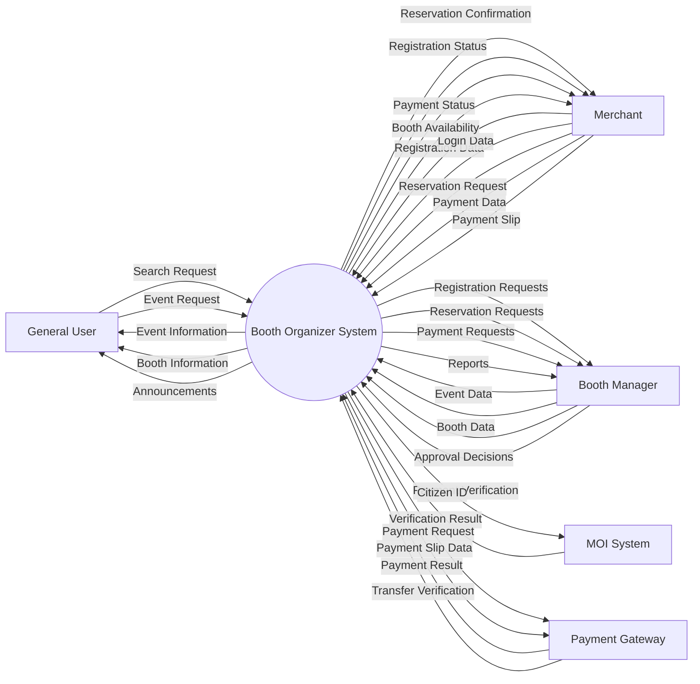
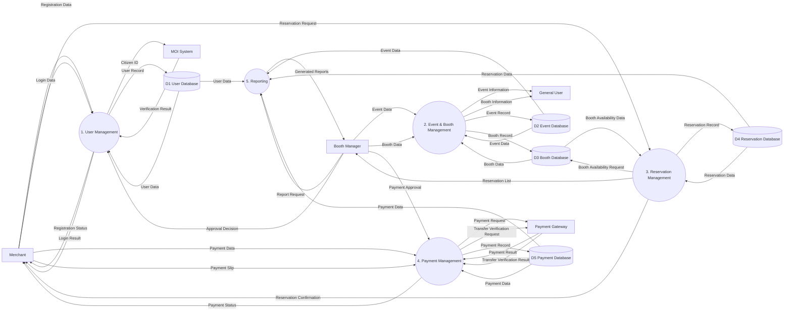
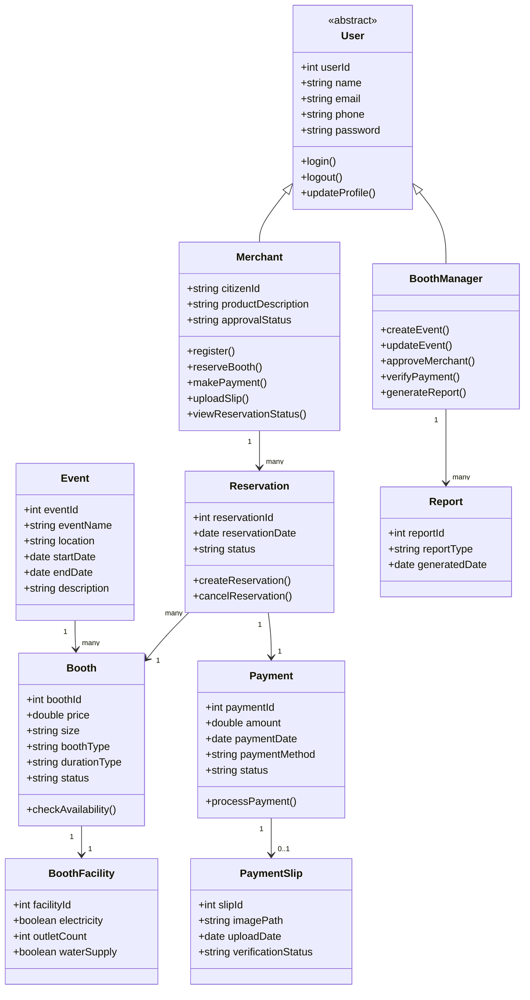

# D1 Design Models and Design Rationale
---

# C4 Context Diagram

---

# C4 Container Diagram

---

# C4 Component Diagram

---

# Use Case Diagram

(To be added)

---

# Data Flow Diagram (DFD)

## DFD Level 0

## DFD Level 1

---

# Class Diagram

# Design Rationale
The system models were created based on the functional and non-functional requirements of the Booth Organizer System to clearly represent the system structure, responsibilities, interactions, and system boundaries.

The Use Case Model represents the system from the user perspective and directly reflects the functional requirements. It shows how the main actors—General User, Merchant, and Booth Manager—interact with the system to perform tasks such as registration, booth reservation, payment, and event management. This model helps identify the core system features and clarifies system boundaries by distinguishing between internal system functions and external services such as the MOI API and payment gateways.

The Context Diagram presents the system at a high level and defines the system boundary between the Booth Organizer System and external entities. It shows how actors such as General Users, Merchants, Booth Managers, and Executives interact with the system, as well as how the system communicates with external services including the MOI API, Credit Card Gateway, TrueMoney Wallet API, and Banking System. This model ensures that external responsibilities such as identity verification and payment processing are clearly separated from the internal system.

The Data Flow Diagram (DFD) focuses on how data moves through the system. It illustrates how information such as user registration data, reservation details, and payment information flows between users, system processes, databases, and external services. The DFD supports design decisions by defining clear process boundaries and showing how the system communicates with external services like the MOI identity verification API and payment systems. It also ensures that key processes such as payment validation and reservation confirmation follow the required workflow.

The Container Diagram describes the high-level technical architecture of the system by dividing it into major containers: the Web Application (Frontend), Backend API Server, and Database. The frontend provides the user interface for general users, merchants, and booth managers, while the backend handles the core business logic such as authentication, reservation management, payment processing, and reporting. The database stores persistent data including users, booths, reservations, and payment records. This separation supports important non-functional requirements such as scalability, maintainability, and security.

The Component Diagram further decomposes the backend into smaller functional components, including Authentication, User Management, Event Management, Booth Management, Reservation, Payment, Notification, and Reporting components. Each component is responsible for a specific part of the system functionality. For example, the Reservation component handles booth booking and prevents double booking, while the Payment component manages financial transactions and integrates with external payment services. This modular structure supports maintainability and scalability by assigning clear responsibilities to each component and enabling loosely coupled interactions between modules.

Finally, the Class Diagram models the internal structure of the system by defining key entities such as User, Merchant, BoothManager, Event, Booth, Reservation, and Payment. The model shows how these entities relate to each other and supports system design decisions by assigning clear responsibilities to each class. For example, the inheritance relationship between User, Merchant, and BoothManager reflects role-based functionality, while the relationships between Reservation, Booth, and Payment represent the reservation and payment workflow defined in the requirements.
Together, these models provide a comprehensive view of the Booth Organizer System. The Use Case Diagram defines system functionality, the Context Diagram defines system boundaries, the DFD explains data flow and interactions, the Container and Component diagrams describe the system architecture, and the Class Diagram represents the internal system structure. This layered modeling approach supports modularity, scalability, maintainability, and clear responsibility separation within the system design.
